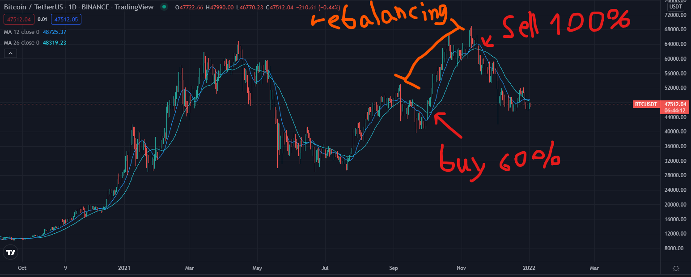

# nicehash trading bot only for BTCUSDT

## Features

1. MA12, MA26 Cross for buy and sell signal.
2. When the trend is up, bot will rebalance the port. and sell all when trend is down.

## How To

1. create new file "Identity.ts" in apps folder.
2. copy text from "Identity.template" and place them in the file.
3. replace it with your key.
4. compile and run.

## Example

